# Documentation

## URL

``http://ugram-team02.s3-website.ca-central-1.amazonaws.com/``

## Connexion
Deux possibilités:

* Connexion via une combinaison email/mot de passe
* Connexion via OAuth2.0 via les services Google

## Création de compte

* Inscription manuelle via le formulaire
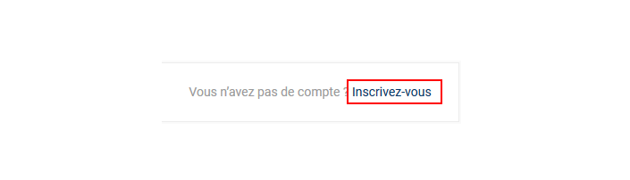

**ou**

* Inscription via OAUth2.0 via les services Google (génère un userId) 

## Home
Regroupe toutes les photos publiées ordonnées par dates (tous utilisateurs confondus) 

``http://ugram-team02.s3-website.ca-central-1.amazonaws.com/``

## Profil d'utilisateur
Permets d'afficher le profil d'un utilisateur spécifique
Sur ce profil est regroupé:
 
* Les informations de l'utilisateur

* Toutes les photos publiées par cet utilisateur  
 
``http://ugram-team02.s3-website.ca-central-1.amazonaws.com/profil/<nom_utilisateur>``

## Recherche
Possibilité de chercher par tag/identification/nom d'utilisateur

* Tags/Identifications:

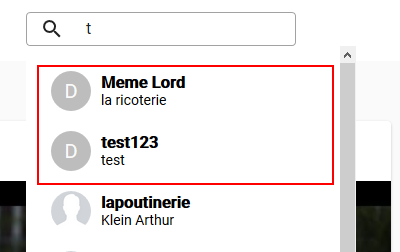

* Utilisateurs :

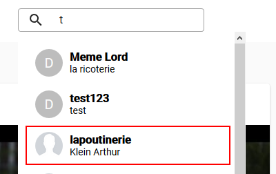

## Liste des utilisateurs

``http://ugram-team02.s3-website.ca-central-1.amazonaws.com/explore/``

## Image
Lorsqu'un utilisateur téléverse une image il est possible:
* D'ajouter une description
* D'ajouter des mots-clés
* D'identifier d'autres utilisateurs

## Réactions
Il est possible de réagir aux images via un système de like et de commentaire

* Like d'une image

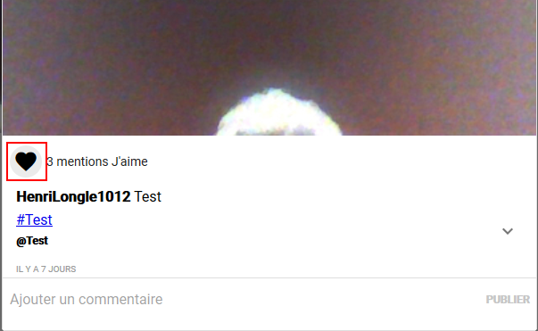

* Commenter une image

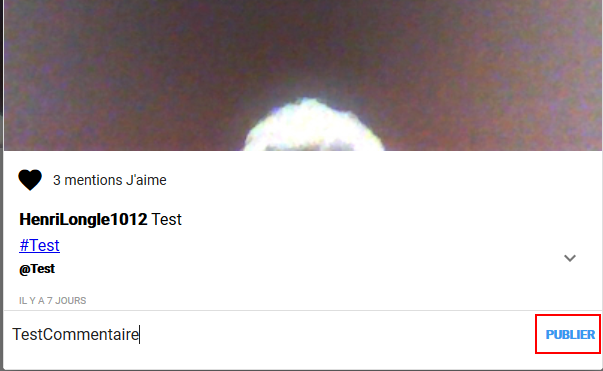

* Consultation des réactions d'une image

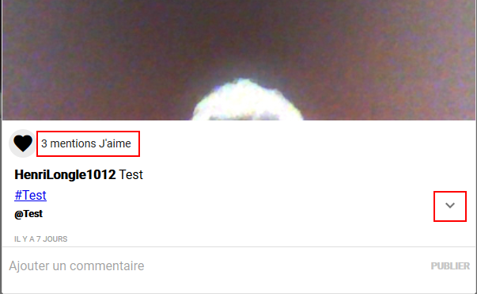

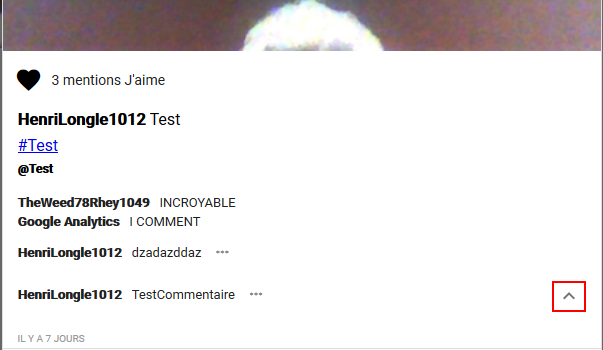

## Administration réactions
Il est possible de retirer sa réaction (like ou commentaire) voir-ci dessous

* Suppression d'un like, il suffit de recliquer sur le bouton

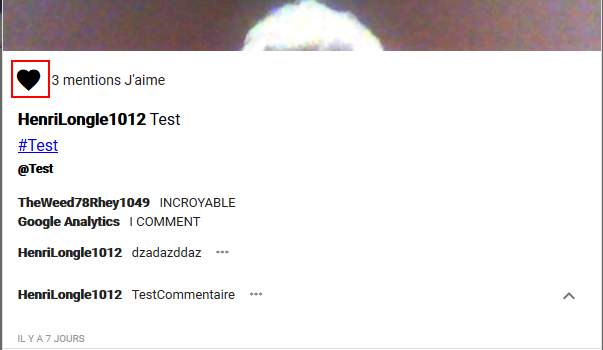

* Suppression d'un commentaire

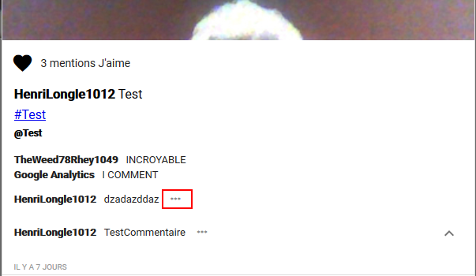

## Notifications
Les réactions des autres utilisateurs à vos images envoient des notifications

* Elles sont disponibles dans la barre de navigation

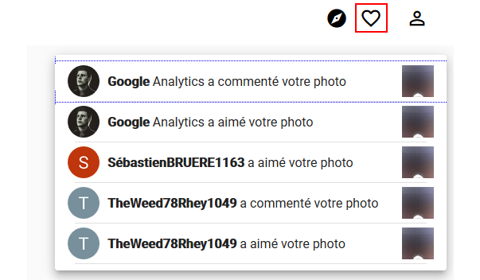

## Administration

#### Administration du profil

Si l'utilisateur connecté consulte son profil il aura accès aux outils d'administration:
* Modifications des informations personnelles
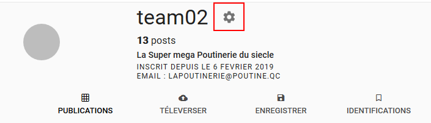

* Administration de ses images
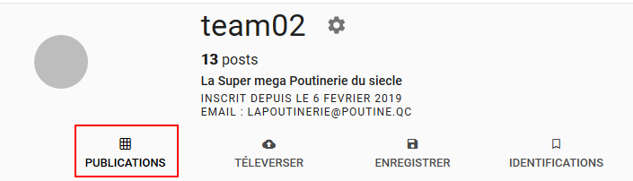

* Téléversement d'une image
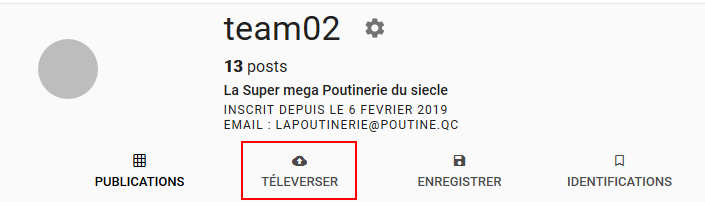

#### Administration d'une image
Si l'utilisateur connecté consulte une de ses images, il aura accès aux outils d'administration:

* Suppression de l'image
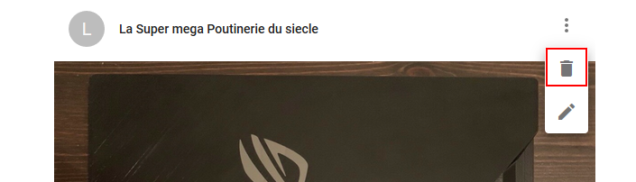

* Gestion de la description, des mots-clés et des identifications:
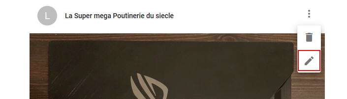

#### Déconnexion et suppression du compte
Une fois dans le panel d'administration du profil, l'utisateur aura la possibilité de se déconnecter et de supprimer son compte

* Déconnexion

* Suppression du compte

#### Fonctionnalités additionnelles

* Recherche par mot-clé/description avec auto-complétion
 
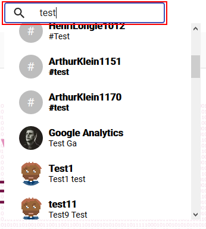

Il suffit de taper le mot-clé/la description dans la barre de recherche

* Mots-clés populaires

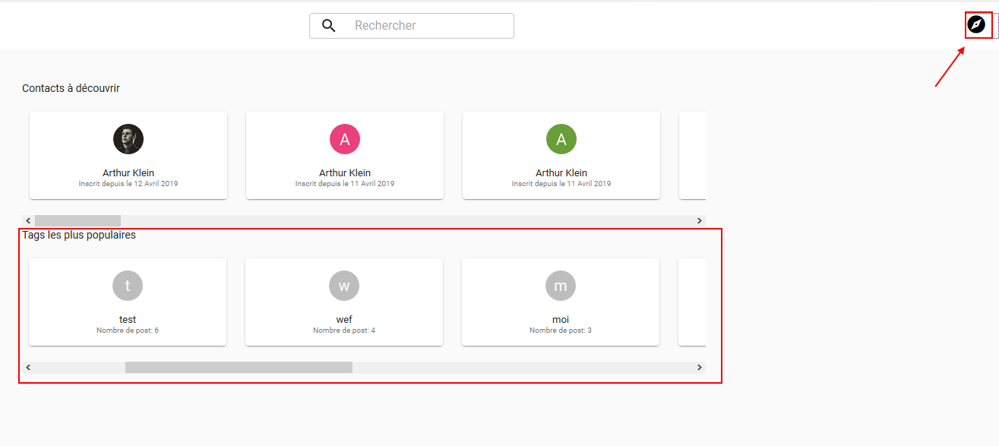

Il suffit d'accéder à l'onglet exploration via la barre de navigation (voir image ci-dessus) et les tags les plus populaires s'affichent

* Filtres sur les photos au moment du téléversement

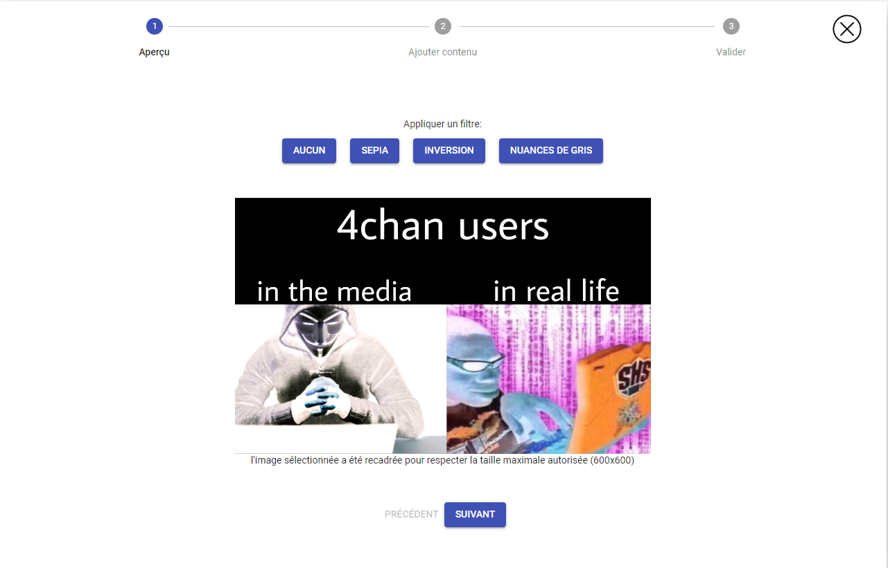

* Téléversement d'une image via webcam

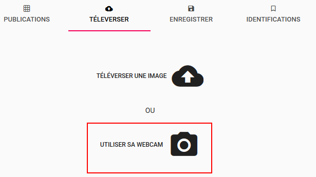

[Lien vers le rapport Google Analytics](./Analytics.pdf)

