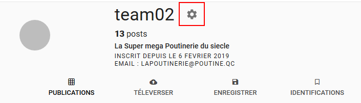
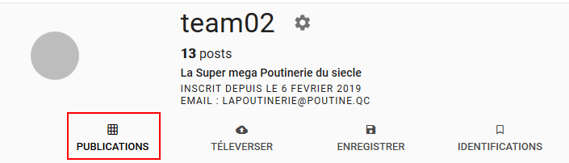
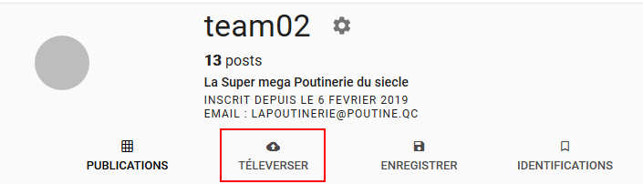
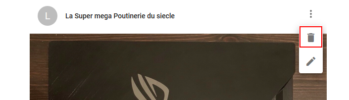
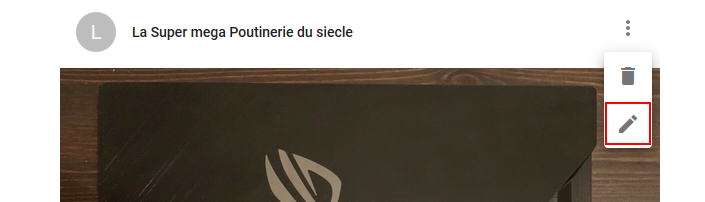

# Documentation

## Home
Regroupe toutes les photos publiées ordonnées par date (tout utilisateur confondu) 

``http://ugram-team02.s3-website.ca-central-1.amazonaws.com/``

## Profil d'utilisateur
Permet d'afficher le profil d'un utilisateur spécifiquue
Sur ce profil est regroupé:
 
* Les informations de l'utilisateur

* Toutes les photos publiées par cet utilisateur  
 
``http://ugram-team02.s3-website.ca-central-1.amazonaws.com/profil/<nom_utilisateur>``

## Liste des utilisateurs

``http://ugram-team02.s3-website.ca-central-1.amazonaws.com/users/``

## Image
Lorsqu'un utilisateur téléverse une image il est possible:
* D'ajouter une description
* D'ajouter des mots-clés
* D'identifier d'autres utilisateurs

## Administration

#### Administration du profil

Si l'utilisateur connecté consulte son profil il aura accès aux outils d'administration:
* Modifications des informations personnelles

* Administration de ses images

* Téléversement d'une image

#### Administration d'une image
Si l'utilisateur connecté consulte une de ses images, il aura accès aux outils d'administration:

* Suppression de l'image

* Gestion de la description, des mots-clés et des identifications:

